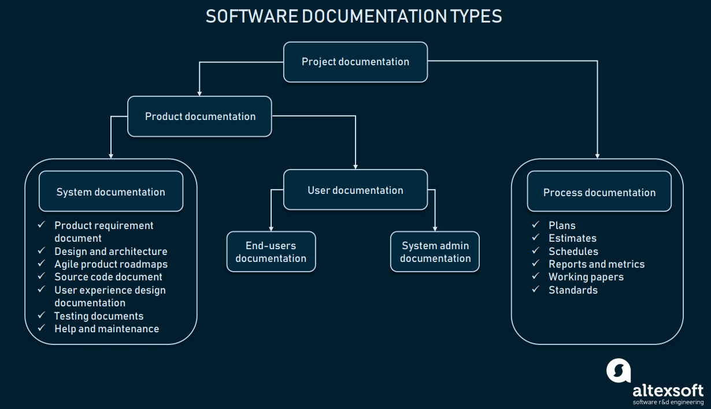
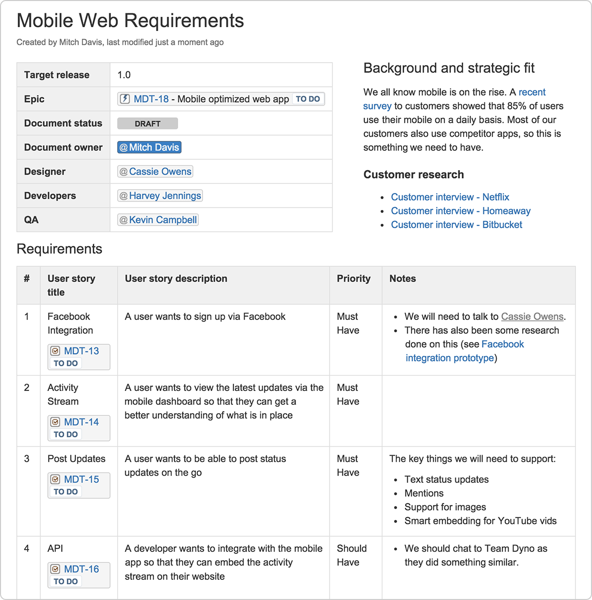
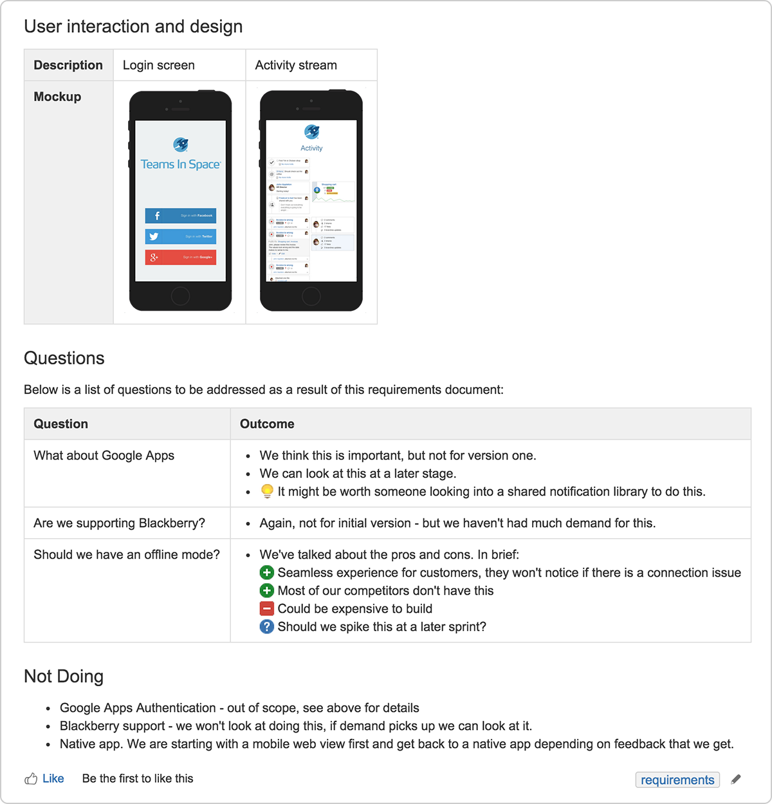
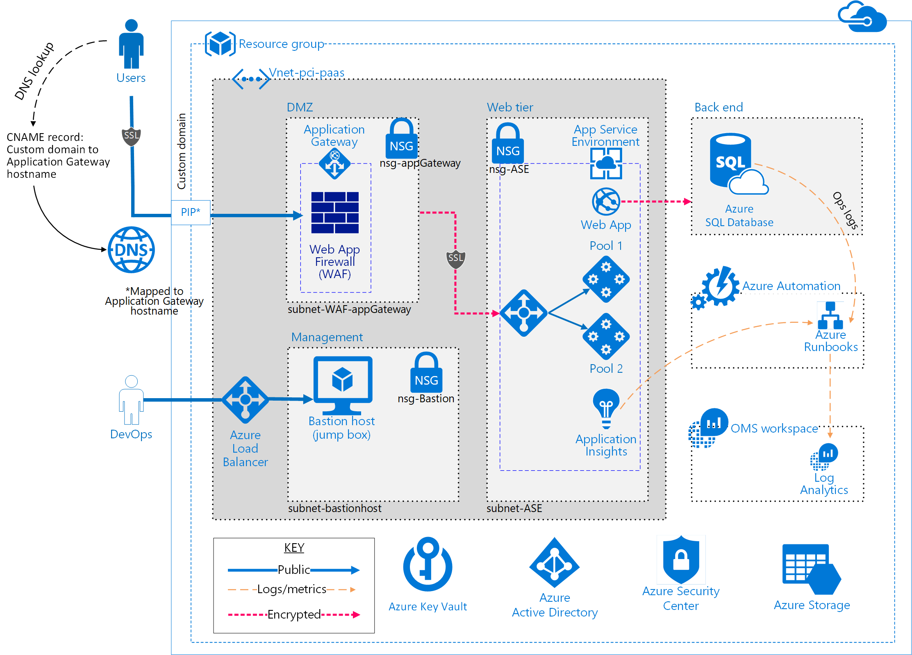
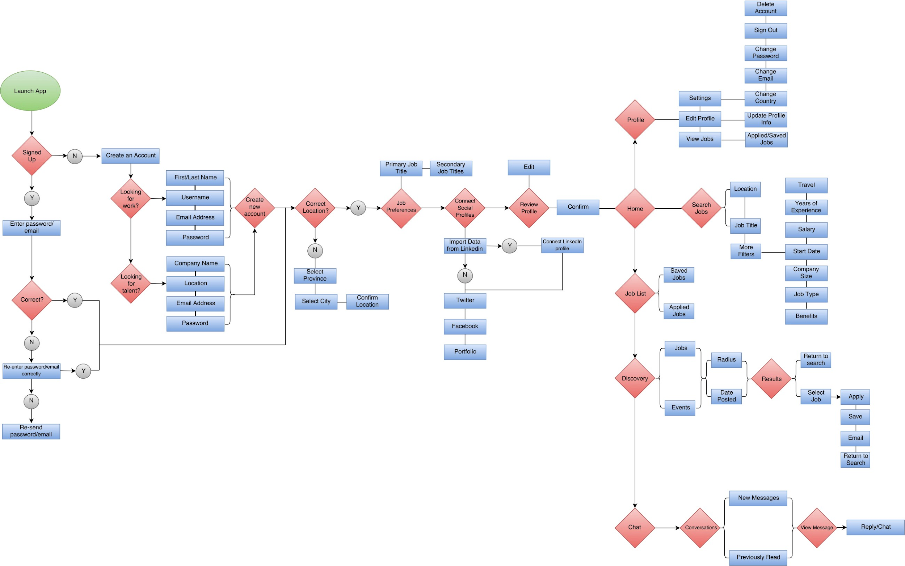
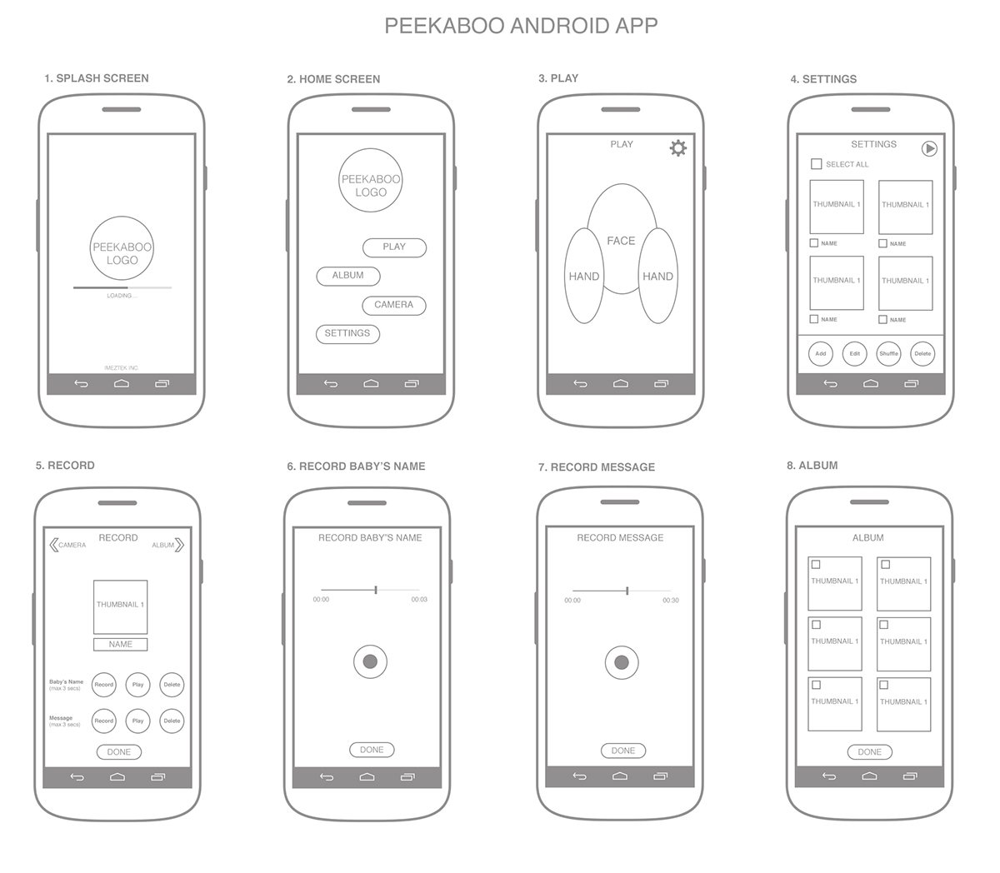

# چهارچوبی برای  ساخت داکیومنت برای پروژه های نرم افزاری:

انواع داکیومن ها: 

## پروژه های نرم افزاری به دو گروه دسته بندی می شوند:
### Product documentation:

1.System documentation:
    
    1.داکیومنت الزامات و احتیاجات پروژه
    2.داکیومنت معماری نرم افزار
    3.داکیومنت سورس کد
    4.داکیومنت ux
    5.داکیومنت تامین کننده ی کیفیت
    6.راهنمای سیستم و نگه داری آن
    7.داکیومنت API

2.User documentation:

محصول ساخته شده را شرح می دهد و چگونه ی کاربا محصول را ارائه میدهد.

#### System documentation:
 کل سیستم و زیر مجموعه هایش را شرح می دهد. این داکیومنت شامل الزامات نرم افزار ،ui ، توصیف معماری، سورس نرم افزار ، Api documentation و سوالات متداول (FAQs) میشود.

#### User documentation:
یک راهنمای کامل برای کاربر نهایی سیستم و مدیر سیستم (administrators) است. این داکیومنت شامل آموزش کامل ، راهنمای کاربری ، راهنمای عیب یابی ، نصب و reference manuals باشد.
### Process documentation: 
مراحل انجام پروژه را شرح میدهد. چشم انداز پروژه ، تست های انجام شده در محیط های مختلف. مکاتبات انجام شده شده در جلسات در زمان ساخت پروژه و حتی مکاتبات تجاری انجام شده.

## Product documentation:
### System documentation:
#### داکیومنت الزامات و احتیاجات پروژه:
    داکیومنت الزامات و احتیاجات پروژه داکیومنتی است که درباره ی عمل کرد سیستم نوشته می شود. بطور کلی الزامات در این جا به معنی تیتر هایی که توضیح می دهند سیستم چه کاری باید انجام دهد.این داکیومنت باید کاملا واضح ،خلاصه شده و تمیز باشد.best practice برای این داکیومنت استفاده از یک تمپلیت جامع و ثابت است که برای بقیه اعزای تیم خوانا باشد.
    

    در بالا نمونه ای از الزامات و احتیاجات پروژه آورده شده.
    توصیه ها برای نوشتن این گونه داکیومنت:
        1. نقش ها و مسئولیت ها
        2. اهداف تیم و هدف کسب و کار
        3. پس زمینه و اهداف استراتژیک
        4. تهیه لیست اصطلاحات پروژه
        5. تهیه لیست User Stories که برای پروژه ضروری می باشد 
        6. ملاک پذیرش(مشخص کردن بهترین حالت از بازخورد ها)
        7. ui و wireframe 
        8. سوالات و جواب هایی که اعزای تیم در حین توسعه ی پروژه برمیخورند و به آن ها پاسخ می دهند.
        9. تکنلوژی هایی که در آینده باید به پروژه اضافه شود.
    و به عنوان آخرین توصیه در این بخش  برای جامع تر کردن این بخش از 2 متد قوی زیر پیروی کنید.
        1. لینک ها و لنگرها(links and anchors)
        2. ابزار های نمودار سازی (diagramming tools) انسان ها ترجیح می دهند به عکس ها نگاه کنند تا اینکه متن را بخوانند.
   
#### داکیومنت معماری نرم افزار:
طراحی و معماری کلی نرم افزار مانند مثال زیر:

#### داکیومنت سورس کد:

در اصل همان کامنت گزاری در کد است .این بخش یک بخش تکنیکی است که در این داکیومنت خواهد گفت که سورس کد چگونه کار خواهد کرد.در این قسمت مهم ترین مفاهیم باید نوشته شود تاخواننده که معمولا برنامه نویسان هستند به راحتی درک کنند.برخی از نکات برای داکیومنت نویسی سورس کد:
    
    1. کد باید برای انسان ها نوشته شده باشد.
    2. کامنت گزاری بخشی از کد نویسی است.
    3. ساختار بهتر
    4. نامگزاری بهتر
    5. استفاده از اکستنشن های کامنت گزاری در ادیتور ها و یا ide ها

#### داکیومنت ux:

یکی از مهم ترین و اساسی ترین داکیومنت ها این داکیومنت خواهد بود زیرا در تمامی مراحل ساخت پروژه همواره مورد استفاده خواهد بود.چند نمونه از این نوع داکیومنت در زیر آورده شده:
    
    User Flow:
    نمونه نقشه ای است از یک فرآیند که نشان میدهد یوزر در هر مرحله چه کاری انجام میدهد

    Wireframes:
    یک طرح کلی از طرح آینده در واقع نشان می دهد چگونه ui اندازه گیری خواهد شد.

    mock-up :
    مرحله ی بعدی از design خواهد بود. در این مرحله نشان خواهد داد که محصول نهایی به چه شکل خواهد بود.

#### داکیومنت تامین کننده ی کیفیت:

در این داکیومنت نحوه ی نوشتن تست ، test plan ، Test strategy نوشته خواهد شد. و قرار است تست متد ها در این داکیومنت مشخص شود.

#### راهنمای سیستم و نگه داری آن:

در این داکیومنت باید مشکلات احتمالی سیستم و راه حل های احتمالی آن آورده شود.همچنین در این داکیومنت باید وابستگی های بین قسمت های مختلف سیستم آورده شود.

#### داکیومنت API

یکی از مهم ترین انواع api است که در این نوع باید دقت شود که به یک برنامه نویس میدهیم و در حد امکان فرض شود که هیچ توضیح دیگری او لازم نداشته باشد. همچنین باید انواع حالات برخورد با آن api قرار داده شود و حالت ها مشخص شوند.

### User documentation:

#### کاربر نهایی سیستم

#### مدیر و مجری سیستم

